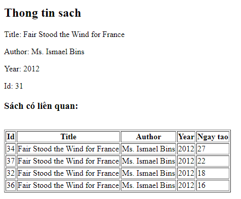
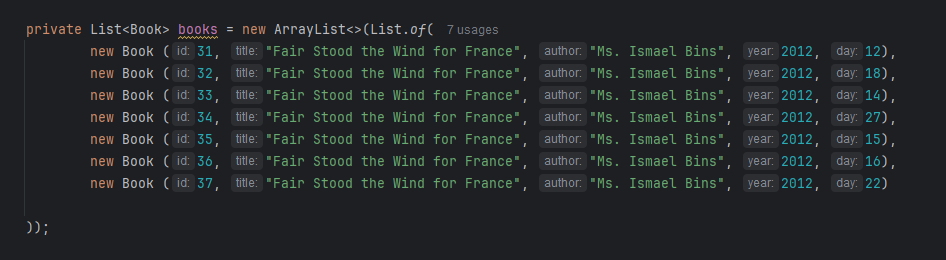

### Trong trang chi tiết sách: http://localhost:8080/books/{id} thực hiện tìm kiếm các cuốn sách liên quan và hiển thị trong trang chi tiết (book-detail.html).

- controller: [BookController](./src/main/java/com/example/demothymeleaf/controller/BookController.java)
- resources: [book-detail](./src/main/resources/templates/book-detail.html)
```ruby
public String getBooksDetail(@PathVariable int id, Model model) {
        Book book = books.stream()
                .filter(b -> b.getId() == id)
                .findFirst()
                .orElse(null);
        List<Book> newBooks = books.stream()
                .filter(o -> o.getAuthor().equals(book.getAuthor()) && o.getId() != book.getId())
                .sorted((o1, o2) -> o2.getDay() - o1.getDay())
                .limit(4)
                .toList();

        model.addAttribute("book", book);
        model.addAttribute("books", newBooks );
        return "book-detail";
    }
```
### Giao dien:



### Data demo:

