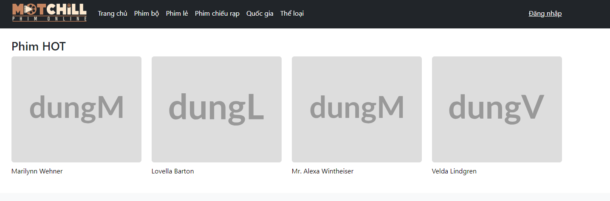
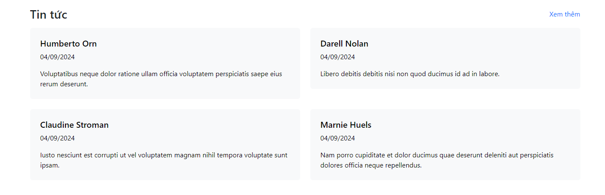

## Yêu cầu
### Học viên thực hiện việc hiển thị dữ liệu cho các phần sau trong trang chủ:
source code: 
[MovieService](./src/main/java/com/example/movieapp/service/MovieService.java)
[BlogService](./src/main/java/com/example/movieapp/service/BlogService.java)
[WebController](./src/main/java/com/example/movieapp/controller/Webcontroller.java) 
- Danh sách phim hot (lấy theo rating giảm dần, tạm thời lấy 4 bản ghi để hiển thị, nếu về sau làm slider ở chỗ này có thể lấy nhiều bản ghi hơn)

Hình ảnh minh họa: 

Danh sách bài viết (lấy theo status = true, thời gian tạo giảm dần, lấy 4 bản ghi)
- Bài viết cần fake data để hiển thị

Hình ảnh minh họa: 

### Làm giao diện:
Học viên làm giao diện cho 2 trang sau:
- Danh sách blog: [Blog-list](https://kynkner.github.io/Demo-blog-list/)
- Chi tiết blog: [Blog](https://kynkner.github.io/Demo-blog/)